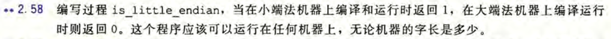
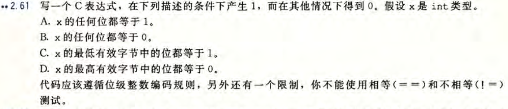
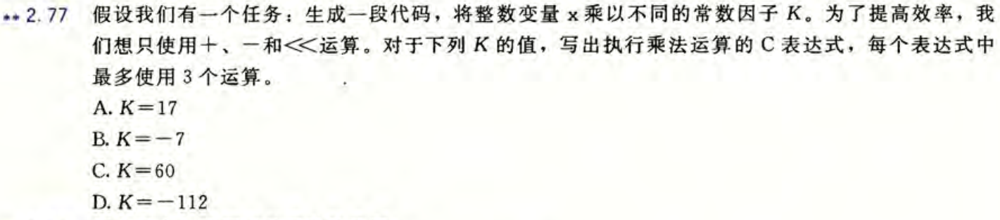
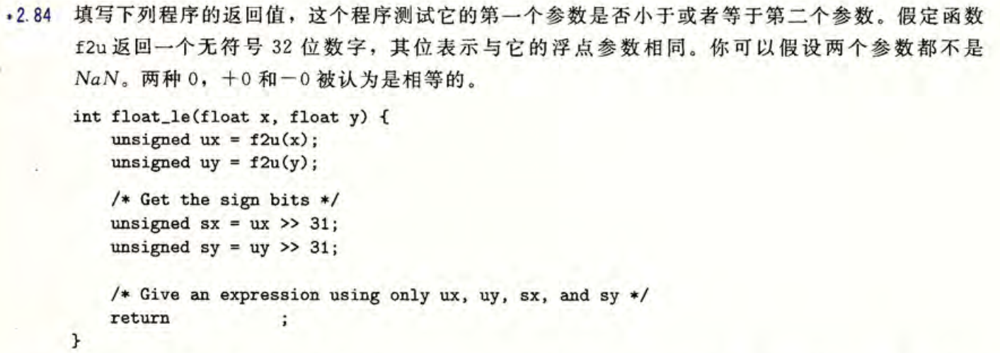
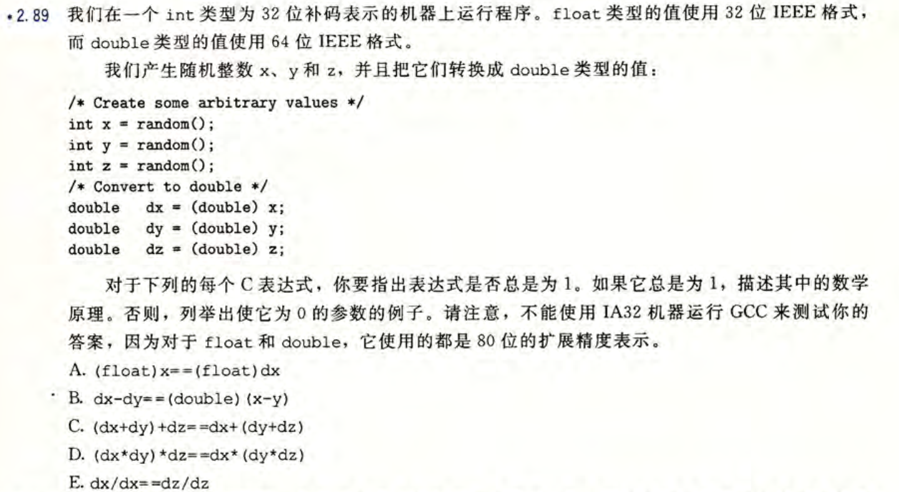
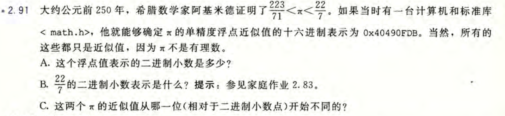

## hw1

### 2.58

```C
int is_little_endian() {
    int x = 1;
    return *(char *)&x;
}
```

### 2.61

```C
(!(x+1)) | (!x) | (!((x & 0xFF) ^ 0xFF)) | (!((x >> ((sizeof(int)-1) << 3)) & 0xFF))
```

### 2.77


A:
```C
K << 4 + K
```

B:
```C
-(K << 3 - K)
```

C:
```C
(K << 6) - (K << 2)
```

D:
```C
(K << 4) - (K << 7)
```

### 2.84


```C
((sx == 1) && (sy == 0)) || \
((ux << 1) == 0 && (uy << 1) == 0) || \
(sx == 0 && sy == 0 && ux <= uy) || \
(sx == 1 && sy == 1 && ux >= uy)
```

### 2.89

**表达式A**：
总是为1。double可以精确表达的整数范围比32位int更大，因此dx与x表示同样的精确整数，转换为float的结果也是一样的。

**表达式B**：
x取2^31-1，y取-3时为0。因为左边没有溢出，右边会溢出。

**表达式C**：
总是为1。3个int类型整数相加不会超过double可以精确表示的整数范围，不会溢出或出现舍入误差。

**表达式D**：
x和y均取2^31-1，z取1145141919时为0。因为超过了double可以精确表示的整数范围，出现了误差。

**表达式E**：
x不为0，z为0时表达式为0。此时dz/dz结果为-nan

### 2.91


A:
0x40490FDB对应的二进制形式为：01000000010010010000111111011011，其中符号位为0，移码为10000000，减去偏移量127得到指数为1，尾数为10010010000111111011011，因此对应的二进制小数为1.10010010000111111011011 * 2^1 = 11.0010010000111111011011。

B:
11.001001001....，循环节为001。

C:
从小数点后第9位开始不同。